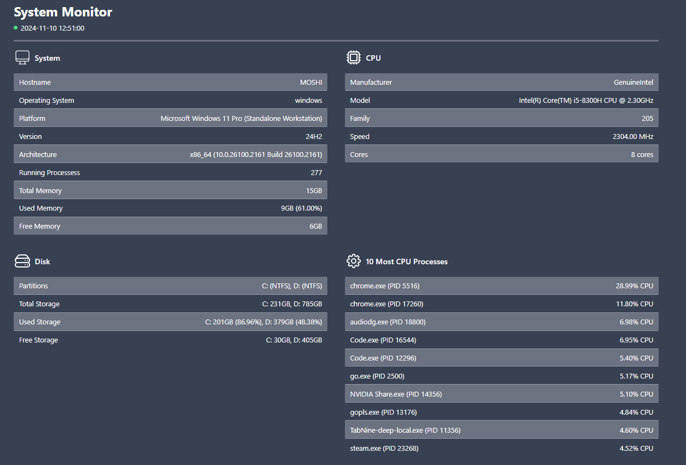

# GoSysMon

Is a simple web based System Monitoring built with Go. It displays computer informations such are host, processes, memory, CPU, and disk. By using websocket, the data will automatically been refreshed within 3 seconds.



## Stacks

+ Go 1.23.1
+ HTMX
+ Websocket HTMX Extension
+ Tailwindcss
+ [Gopsutil](https://pkg.go.dev/github.com/shirou/gopsutil/v4)
+ [Websocket](https://github.com/coder/websocket)

## Running The Application

+ copy env file `cp .env.example .env` and adjust you desire port (default port is `8000`)
+ run the application locally

```bash
go run ./cmd/main.go
```

+ visit `localhost:8000`
